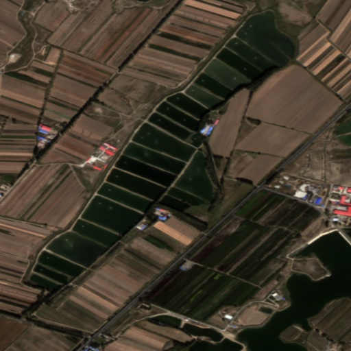
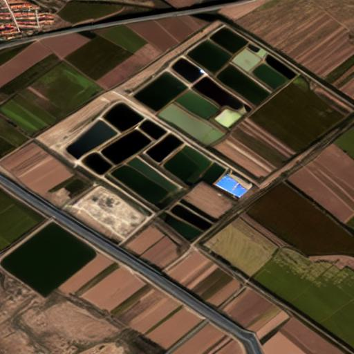

## Transferable image synthesis for remote sensing semantic segmentation via joint reference-semantic fusion
**Abstract:** With the advancement of diffusion model-based generative methods, synthesizing pixel-level training datasets has emerged as a promising approach to mitigate the scarcity of annotated data in semantic segmentation tasks. However, a noticeable gap persists between data synthesis and semantic segmentation tasks in the remote sensing (RS) domain. Due to the diversity of RS data across sensors and spatial scales, relying solely on limited annotated data and pre-trained generative foundation models to synthesize training data brings minor improvements in RS semantic segmentation tasks. Therefore, it becomes crucial to incorporate large volumes of unlabeled external data into downstream tasks to enable more transferable image synthesis. Unlike training-free approaches that introduce reference (Ref) images primarily for shallow feature transfer, we propose a joint learning strategy that integrates Ref images, semantic masks, and text prompts during training. This facilitates multi-modal interaction and allows the model to capture deeper features such as content. To achieve effective multi-modal information fusion, the proposed Transferable Image Synthesis method (TISynth) avoids directly using real Ref images during training. Instead, it generates Ref images from augmented input images, and facilitates interaction between Ref images and semantic information through text prompts and an all-in-attention module. As a data augmentation approach for semantic segmentation task, TISynth improve the OA/mIoU/mAcc by 1.52%/2.32%/3.04% on FUSU-4k, 1.33%/1.06%/3.04% on GID-26k, and 1.15%/1.67%/2.04% on LoveDA (Rural → Urban), compared to the baseline trained only on the original data. Moreover, compared to state-of-the-art segmentation training data synthesis methods, our approach achieves superior performance across datasets of varying scales, resolutions, segmentation complexities, and domains.
## Setup

### Environment

* 64-bit Python 3.8 and PyTorch 1.12.0 (or later).
* Download the repo and setup the environment with:

```bash
git clone https://github.com/dongrunmin/xxx
cd TISynth
conda env create -f tisynth.yml
conda activate tisynth
```

Then, in `ldm/modules/encoders/modules.py`, set the default value of the version argument in the `FrozenCLIPEmbedder.__init__` method to the local path of the downloaded `openai/clip-vit-large-patch14` model.
```python
 def __init__(self, version="your_path", device="cuda", max_length=77, freeze=True, layer="last", layer_idx=None):  # clip-vit-base-patch32
```

### Dataset

We conducted experiments on the three datasets [LOVEDA](https://github.com/Junjue-Wang/LoveDA), [GID](https://x-ytong.github.io/project/GID.html), and [FUSU](https://github.com/yuanshuai0914/FUSU). You can also build your own dataset for testing; the required directory structure is as follows:

```angular2html
├── FUSU
│  ├── ref_img/             # reference images directory
│  ├── img_test/            # test-set images
│  ├── label_test/          # semantic masks for the test set
│  ├── img_train/           # training-set images
│  ├── label_train/         # semantic masks for the training set
│  ├── test_set_items.json  # JSON file describing the organization of the test set
│  └── train_set_items.json # JSON file describing the organization of the training set
```

The format of `train_set_items.json` is as shown below:

```
{"source": "Label PNG files relative to the dataset root directory, e.g., label_train/xxx.png", "target": "Image JPG files relative to the dataset root directory, e.g., img_train/xxx.jpg.", "prompt": "A prompt that describes image information"}
{"source": "Label PNG files relative to the dataset root directory, e.g., label_train/xxx.png", "target": "Image JPG files relative to the dataset root directory, e.g., img_train/xxx.jpg.", "prompt": "A prompt that describes image information"}
...
```

* The "source" mask and the corresponding "target" image must be one-to-one.

### Download Models

We provide pre-trained weights and inference weights trained on the [GID](https://x-ytong.github.io/project/GID.html) dataset. You can download them from [Google Drive](https://drive.google.com/file/d/15i-beG-7b5lLL_pJXSI7mVT4zokNBJib/view?usp=drive_link); the weights directory structure is as follows:

```angular2html
├── TISynth_models
│  ├── controlnet1.5.ckpt  # Pre-training weights are used to initialize Tisynth.
│  └── GID_model.ckpt # Checkpoint trained on the GID dataset.
```

- **Unzip**: Run the following command to decompress the zip weight file

```bash
python -m zipfile -e TISynth_models.zip .
```

## Inference on Demo

- We provide the `demo.sh` script to offer a simplest and fastest way for you to run our model.

```bash
sh demo.sh
```

### Generated Result

- Control conditions
  - Mask
    
  
  - Ref Image
    

- Generated Image
  

## Training

We provide an example for training Tisynth on your custom dataset. Please modify the paths in `train.sh` and run command:

  ```bash
  sh train.sh
  ```

Some important arguments for configurations of the training are:

- `--gpus`: The GPU indices you use; for example, if you are using GPUs 0–4, set them to 0,1,2,3. 
- `--data_root`: The path to dataset.
- `--train_txt_file`: Training-dataset JSON file, in the form of `train_set_items.json`.
- `--val_txt_file`: Testing-dataset JSON file, in the form of `test_set_items.json`.
- `-n`: Path name where the checkpoint (ckpt) will be saved.
- `--base`: Training parameter settings, such as **batch size**, **learning rate**, and other hyper-parameters.
- `--config_model`: Model parameter settings, such as network architecture, data-augmentation strength, etc..
- `--pretrain_path`: The weights used to initialize **Tisynth**

## Inference

  ```bash
  sh inference.sh
  ```

Some important arguments for configurations of the inference are:

- `--config`: Model parameter settings, such as network architecture, data-augmentation strength, etc..
- `--data_root`: The path to dataset.
- `--train_txt_file`: Inference JSON file, in the form of `inference_items.json`, including ref image.
- `--seed`: The random seed.
- `--ckpt`: The checkpoint (ckpt) weight file trained during the training phase.
- `--outdir`: Directory where generated images will be saved; it will be created automatically if it does not exist.

The format of `inference_set_items.json` is as shown below; you can directly modify it based on the contents of `train_set_items.json`:

```
{"source": "Label PNG files relative to the dataset root directory, e.g., label_train/xxx.png", "target": "Image JPG files relative to the dataset root directory, e.g., img_train/xxx.jpg.", "prompt": "A prompt that describes image information", "ref_image": "Reference JPG image relative to the dataset root, e.g. ref_img/xxx.jpg"}
{"source": "Label PNG files relative to the dataset root directory, e.g., label_train/xxx.png", "target": "Image JPG files relative to the dataset root directory, e.g., img_train/xxx.jpg.", "prompt": "A prompt that describes image information", "ref_image": "Reference JPG image relative to the dataset root, e.g. ref_img/xxx.jpg"}
...
```

## Post-processing

- In this project, we perform post-processing on the generation results of the `Tisynth`, generate corresponding masks for the results, and then filter out some masks with poor generation effects.

- The post-processing code is built on [MMSegmentation](https://github.com/open-mmlab/mmsegmentation), so create a clean environment and install its dependencies first.

- The configuration files based on the [FUSU](https://github.com/yuanshuai0914/FUSU) are provided in `demo/mmseg`, You can refer to the documentation of [MMSegmentation](https://github.com/open-mmlab/mmsegmentation/blob/main/docs/en/user_guides/1_config.md) to configure the environment and train a semantic segmentation model for a specific task.

- After training a mmseg-based semantic segmentation model, run the following command to perform **post-processing** operation.

1. Process the masks

```bash
conda activate mmsegmentation
sh filter.sh
```

  Some important arguments for configurations of filtration are:
  - `The 1st positional param`: A mmseg-style config file, you can refer to the documentation to configure it yourself. We also provide a demo; simply update the data paths inside to run. The same config file can be used with `MMSegmentation`, but you must set up the remaining environment as described in this [documentation](https://github.com/open-mmlab/mmsegmentation/blob/main/docs/en/user_guides/1_config.md).
  - `The 2nd positional param`: Path to the semantic-segmentation model weights trained with `MMSegmentation`.
  - `--real-img-path`: The path of the real images.
  - `--real-label-path`: The path of the real mask corresponding to the real images.
  - `--syn-img-path`: The path of the synth images.
  - `--syn-mask-path`: Set it to be the same as the `--real-label-path` param.
  - `--filtered-mask-path`: The processed mask path.

2. Sample from the filtered-masks

Before executing the following command, you need to modify the corresponding content in  `post-processing/resample.py`. Specifically, you need to update the `cls2id` dict, and specify the category names that have poor classification results in the original semantic segmentation model.

Below, we use the **FUSU** dataset as an example to illustrate the required modifications.

**cls2id example**:
```python
cls2id = {
    'traffic land': 0,
    'inland water': 1,
    'residential land': 2,
    'cropland': 3,
    'agriculture construction': 4,
    'blank': 5,
    'industrial land': 6,
    'park': 7,
    'greenbelt': 8,
    'public management and service': 9,
    'commercial land': 10,
    'public construction': 11,
    'special': 12,
    'forest': 13,
    'storage': 14,
    'wetland': 15,
    'grass': 16,
}
```

**Specify the category names** that have poor classification results:
```python
inaccurate = ['agriculture construction', 'special', 'public construction', 'commercial land', 'grass']
```

```bash
sh resample.sh
```

Some important arguments for configurations of sampling are:
- `--filtered-mask-path`: The path of the filtered mask generated in the previous step.
- `--syn-img-path`: The path of images generated in inference.
- `--out-dir`: The path of sampled masks and generated images.

## Citation

## Acknowledgements

This implementation is based on [ControlNet](https://github.com/lllyasviel/ControlNet), [CoSeR](https://github.com/VINHYU/CoSeR), and [Freemask](https://github.com/LiheYoung/FreeMask). Thanks for their public codes.